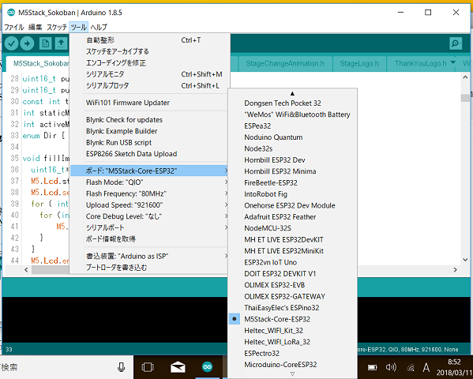
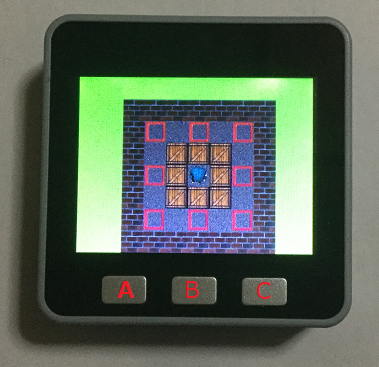

# M5Stack_Sokoban
MhageGHさんの倉庫番をM5Stackに移植させていただきました。  
オリジナルはこちら。 
Sokoban on esp32 and ILI9328 <https://github.com/MhageGH/esp32_ILI9328_Sokoban> 

---
### 必要な物 ###
* [M5Stack](http://www.m5stack.com/ "Title") (Grayで動作確認をしました。) 
* Arduino IDE (1.8.5で動作確認をしました。) 
* [Arduino core for the ESP32](https://github.com/espressif/arduino-esp32 "Title")
* [M5Stack Library](https://github.com/m5stack/M5Stack.git "Title")

補足 : ArduinoIDEへのM5StackボードのインストールはM5Stackに付属の説明書の通りにやっても上手くいきませんでした。 
M5Stack LibraryをインストールすればボードリストにもM5Stackが現れました。 

   

### 操作方法 ###

 

* Aボタン：左移動 
* Bボタン：上移動 
* Cボタン：右移動 
* AボタンCボタン同時押し：下移動 
* BボタンCボタン同時押し：リスタート  
ボタンの同時押しは少し慣れが必要かもしれません。 
２つのボタンを少し長めに押す感じにすると上手くいくと思います。   
